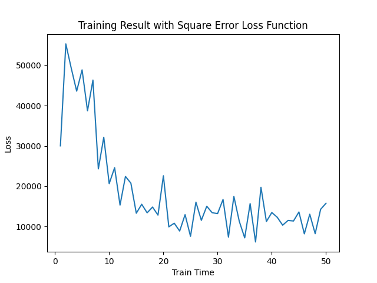

# 机器学习与数据挖掘 Assignment1

| 姓名     | 张烨禧     | 学号     | 18340216           |
| -------- | ---------- | -------- | ------------------ |
| 完成时间 | 2021/04/02 | 联系方式 | zetako@outlook.com |

[TOC]

## 建模与训练理论

而一个线性分类器透过特征的线性组合来做出分类决定，对象的特征通常被描述为特征值，而在向量中则描述为特征向量。

将图片或其他数据以向量的形式表示，计算一个权重（weight）、偏置（bias），通过线性组合的方式将这个向量表示为另一个形式；我们则可以通过这个结果预测其分类。
$$
f(\boldsymbol{x},\boldsymbol{w},\boldsymbol{b})=\boldsymbol{x}\boldsymbol{w}+\boldsymbol{b}
$$
基于这个理论，我们需要通过训练得到一个合适的权重和偏置；由于课程中主要介绍的是权重的计算方式，因此这次实验中我们不使用偏置，直接求一个合适的权重。

求权重的主要过程是：定义一个能表示我们的权重与真实结果的偏差的损失函数，然后带入当前的权重，计算出损失；同时根据梯度下降的结果，对权重向量进行修正，进行下一次的迭代。这里的主要问题就是需要一个有效的损失函数。课程中给出的损失函数主要有交叉熵和平方差两种。交叉熵的损失函数如下：
$$
L(\boldsymbol{w}_1,\boldsymbol{w}_2,...,\boldsymbol{w}_K)=-\frac1N\sum^N_{i=1}\sum^N_{k=1}\boldsymbol{y}_k^{(i)}\log softmax_k(\boldsymbol{x}^{(i)}\boldsymbol{W})
$$

$$
softmax_i(z)=\frac{e^{z_i}}{\sum^K_{k=1}e^{Z_k}}
$$

其对应的偏导如下：
$$
\frac{\partial L(\boldsymbol{W})}{\partial \boldsymbol{W}}=\frac1N\sum^N_{i=1}x^{(i)T}\left(softmax\left(\boldsymbol{x}^{(i)}\boldsymbol{W}\right)-\boldsymbol{y}^{(i)}\right)
$$
平方差的损失函数则是：
$$
L(\boldsymbol{w})=(\sigma(\boldsymbol{xw})-y)^2
$$
对其作偏导之后得到：
$$
\frac{\partial L(\boldsymbol{W})}{\partial \boldsymbol{W}}=(\sigma(\boldsymbol{xw})-y)\sigma'(\boldsymbol{x})\boldsymbol{x}
$$

## 训练过程

整个训练过程使用**正态分布**来初始化权重向量。

### 交叉熵

使用交叉熵作为损失函数时，我们的学习率先是设为0.01,并且进行50次迭代。

但是，我们可以看到，在40次左右的时候，出现了过拟合的现象。因此我们尝试降低学习率，降低到0.005，这次可以看到，程序虽然在30次左右时出现过拟合，但能够在40次之后接近稳定；最后的预测正确率也比较正常。

### 平方差

对于平方差作为损失函数版本的线性分类器，我们先同样尝试50次迭代，0.01学习率的组合。

可以看到，虽然最后能到达0.751的准确率，但是我们训练过程中，特别是在10次之后，我们的训练其实都没有太多成效，损失值的波动比较大。因此我们尝试降低学习率到0.005，遗憾的是，降低到0.005后，虽然后半段的波动要比0.01学习率时好很多，但是其效果依旧比较差，仍然存在较严重的波动。

可以看到，降低了学习率虽然使得损失降低了一些，但是依旧又比较严重的波动；这应该是平方差损失函数无法较为准确的反映损失所致。

## 实验结果与分析

- 这次实验中，我们使用交叉熵作为损失函数的线性分类器能够达到90%左右的正确率，比较符合我们对这个模型的预期；但是在使用平方差作为损失函数时，我们的损失波动非常大，这可能意味着我们在进行梯度下降时可能做了一次错误的偏导或者我们选择的学习率依旧过高。

- 对于上面的推论，我尝试着保持学习率，加大学习的次数到100次，来观察其趋势；根据下面的图可以看出来我们的推论的依据基本属实：

- 接下来我们尝试着降低学习率，看看是不是我们学习率过高所致：

  但是，在降低学习率之后出现的波动有较大的改观，因此我们可以推断这个实验结果应该与学习率有关。

- 在这次实验中，我对课堂上学习的线性分类器的知识做了更多了解，并且通过自己动手演算，了解了一些这其中的计算方法。