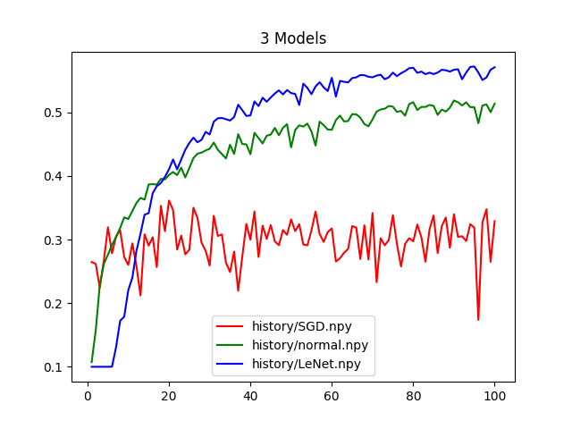
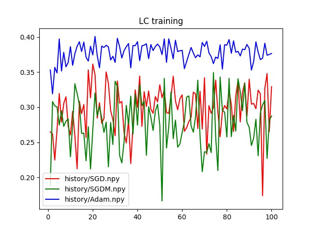
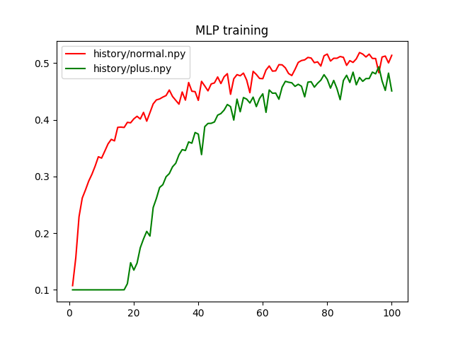
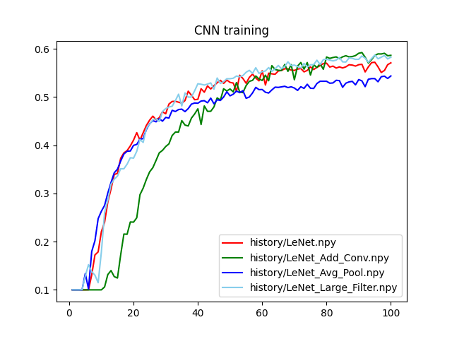

 

# 机器学习与数据挖掘 - 作业3 - 实验报告

| 姓名     | 张烨禧             |
| -------- | ------------------ |
| 学号     | 18340216           |
| 完成时间 | 2021/05/13         |
| 联系方式 | zetako@outlook.com |

[TOC]

## 0. 选定训练框架

实验中，我们需要使用深度学习框架来配合我们的训练，这里我们使用pytorch作为我们的深度学习框架。

## 1. 训练过程

### 1.1 线性分类器

#### 1.1.1 模型

线性分类器的模型比较简单，我们直接使用pytorch提供的线性模型来实现。值得注意的是，为了处理数据，这里我们还引入了一个自定义的类，用来在传入数据计算（forward）的时候进行数据预处理：

```python
class LC(torch.nn.Module):
    def __init__(self):
        super(LC, self).__init__()
        self.linear = torch.nn.Linear(3*32*32, 10)
        
    def forward(self, x):
        x = x.reshape(-1, 3*32*32)
        x = self.linear(x)
        return x
```

这里进行预处理的原因是我们可能传入多个数据，如果不正确的处理数据的维度，模型就不知道哪个维度表示数据的不同。

此外，我们选用交叉熵作为我们的损失函数：

```python
loss_func = torch.nn.CrossEntropyLoss()
```

#### 1.1.2 数据集的处理

我们对读取的数据集进行了一些处理，以方便我们的训练。

```python
train_images = torch.from_numpy(train_images.astype(np.float32)).permute(0, 3, 1, 2) / 255
train_labels = torch.from_numpy(train_labels)
train_dataSet = data.TensorDataset(train_images, train_labels)
train_dataLoader = data.DataLoader(train_dataSet, batch_size = BATCH, shuffle = True)
test_images = torch.from_numpy(test_images.astype(np.float32)).permute(0, 3, 1, 2) / 255
test_labels = torch.from_numpy(test_labels)
```

##### 1.1.2.1 维度重排

这部分主要涉及到两个部分，第一个是我们对图片进行了维度重排，将表示颜色的维度提前到坐标的维度之前；做这个处理主要是为了使训练结果更加明显。在完成模型的过程中，我发现这样的处理能够使模型更快的进行学习；推测原因可能是对于一张图片可以以通道做区分拆成三张图片，这样做的数据依旧具有完整性，因此比坐标数据的重要性更高。

##### 1.1.2.2 数据分批训练

一次性训练读取所有数据训练虽然会有更高的效率，但我们必须考虑到我们设备的限制，如果一次性读入所有数据，会导致内存占用过高等问题，严重影响到我们的训练，因此，对于每个迭代的训练，我们都分多次读取数据。我们使用pytorch提供的`DataLoader`来实现这个需求，为此，我们先创建一个数据集（`train_dataSet`），然后用`train_dataLoader`来读取它。这之后，在实际训练的时候可以根据我们的设置分批读取、训练。

#### 1.1.3 超参数的设置

线性模型用到下面的超参数：

```python
NUM_EPOCHS = 100
BATCH = 100
DEVICE = 'cuda:0'
USE_CUDA = False
DISPLAY = 1
LEARN_RATE = 0.05
MOMENTUM = 0.9
OPTIM_TYPE = 'Adam'

- `NUM_EPOCHS`：指定训练的迭代次数
- `BATCH`：每次读取的数据量
- `DEVICE`：指定CUDA设备
- `USE_CUDA`：指定是否使用CUDA设备计算
- `DISPLAY`：训练过程中是否显示统计数据以及显示间隔
- `LEARN_RATE`：传入优化函数的学习率
- `MOMENTUM`：传入SGD优化函数的参数，使其成为SGD Momentun算法
- `OPTIM_TYPE`：使用的优化算法

#### 1.1.4 实际训练阶段

训练阶段，我们用到下面的代码：

​```python
if USE_CUDA:
    linear_model = linear_model.to(DEVICE)
    test_images = test_images.to(DEVICE)
    test_labels = test_labels.to(DEVICE)

correct_history = []
for epoch in range(NUM_EPOCHS):
    start_time = time.time()
    for index, (image, label) in enumerate(train_dataLoader):
        if USE_CUDA:
            image = image.to(DEVICE)
            label = label.to(DEVICE)
        # cal
        optimizer.zero_grad()
        pred = linear_model(image)
        loss = loss_func(pred, label)
        loss.backward()
        optimizer.step()
    end_time = time.time()
    epoch_dur = (end_time - start_time) * 1000
        
    test_pred = linear_model(test_images)
    test_pred = torch.max(test_pred, 1)[1]
    correct = test_pred.eq(test_labels).sum().item()
    correct = correct / test_size
    correct_history.append(correct)

    # print
    if DISPLAY and epoch % DISPLAY == 0:
        print("epoch={}/{}, loss={:g}, correct={:.4%}, time used={:.4f}ms".format(epoch, NUM_EPOCHS, loss, correct, epoch_dur))
```

这里实际上每个迭代的训练都是同一套过程：清除优化函数记录的梯度=>计算当次预测结果=>计算损失=>计算梯度=>优化模型。但是，为了方便我们之后的分析，我选择在每个迭代之后立即计算现在的模型对于测试集的正确率；这个计算不会影响到我们的模型，所以不存在针对测试集优化的问题。

除此之外，我们还统计每次迭代耗费的时间（不包括预测测试集），用以在后面的分析中量化评估。

### 1.2 多层感知机

#### 1.2.1 模型

多层感知机由多个全连接层组成，换句话说，我们的模型包含多个线性模型，然后在前向传播时将他们连接起来；由于后面我们需要分析模型层数的影响因素，这里我们创建了两个类以供选用：

```python
# MLP class
class MLP(torch.nn.Module):
    def __init__(self):
        super(MLP, self).__init__()
        self.l1 = torch.nn.Linear(32*32*3, 16*16*3)
        self.l2 = torch.nn.Linear(16*16*3, 8*8*3)
        self.l3 = torch.nn.Linear(8*8*3, 4*4*3)
        self.l4 = torch.nn.Linear(4*4*3, 10)

    def forward(self, x):
        x = x.reshape(-1, 32*32*3)
        x = func.relu(self.l1(x))
        x = func.relu(self.l2(x))
        x = func.relu(self.l3(x))
        x = func.softmax(self.l4(x), dim = 1)
        return x

# MLP class with more layer
class MLP_PP(torch.nn.Module):
    def __init__(self):
        super(MLP_PP, self).__init__()
        self.l1 = torch.nn.Linear(32*32*3, 32*16*3)
        self.l2 = torch.nn.Linear(32*16*3, 16*16*3)
        self.l3 = torch.nn.Linear(16*16*3, 16*8*3)
        self.l4 = torch.nn.Linear(16*8*3, 8*8*3)
        self.l5 = torch.nn.Linear(8*8*3, 8*4*3)
        self.l6 = torch.nn.Linear(8*4*3, 4*4*3)
        self.l7 = torch.nn.Linear(4*4*3, 10)

    def forward(self, x):
        x = x.reshape(-1, 32*32*3)
        x = func.relu(self.l1(x))
        x = func.relu(self.l2(x))
        x = func.relu(self.l3(x))
        x = func.relu(self.l4(x))
        x = func.relu(self.l5(x))
        x = func.relu(self.l6(x))
        x = func.softmax(self.l7(x), dim = 1)
        return x
```

这两者的构成是相似的，都有多层线性模型，然后上层的输出作为下层的输入；我们不直接将计算的结果传给下一层，而是先将其通过一个relu激活函数进行单向抑制，主要是考虑到模型训练的精度问题。

除此之外，我们与线性分类器中相同使用交叉熵作为损失函数，选用SGD算法优化。

#### 1.2.2 数据集的处理

数据集的处理与线性分类器中的相同

#### 1.2.3 超参数的设置

MLP模型用到下列超参数：

```python
NUM_EPOCHS = 100
DEVICE = 'cuda:0'
USE_CUDA = False
DISPLAY = 1
BATCH = 100
LEARN_RATE = 0.05
MLP_LAYER = 'plus'
```

- `NUM_EPOCHS`：指定训练的迭代次数
- `BATCH`：每次读取的数据量
- `DEVICE`：指定CUDA设备
- `USE_CUDA`：指定是否使用CUDA设备计算
- `DISPLAY`：训练过程中是否显示统计数据以及显示间隔
- `LEARN_RATE`：传入优化函数的学习率
- `MLP_LAYER`：使用MLP模型

#### 1.2.4 实际训练阶段

实际孙连的阶段基本与线性分类器相同

### 1.3 卷积神经网络

#### 1.3.1 模型

原始的LeNet模型是如下的结构：

1. 卷积层：
   - 输入：32*32
   - 卷积核大小：5*5
   - 卷积核数量：6
   - 神经元分布（输出）：28\*28\*6
2. 池化层：
   - 输入：28*28
   - 采样大小：2*2
3. 卷积层：
   - 输入：6\*14\*14
   - 卷积核大小：5*5
   - 卷积核数量：16
   - 神经元分布（输出）：16\*10\*10
4. 池化层：
   - 输入：10*10
   - 采样大小：2*2
5. 全连接层：
   - 输入：16\*5\*5
   - 输出：120
6. 全连接层：
   - 输入：120
   - 输出：84
7. 全连接层：
   - 输入：84
   - 输出：10

根据上面的的描述，我们构筑模型：

```python
# Original LeNet
class LeNet(torch.nn.Module):
    def __init__(self):
        super(LeNet, self).__init__()
        self.pool = torch.nn.MaxPool2d(2, 2)
        self.conv1 = torch.nn.Conv2d(3, 6, 5)
        self.conv2 = torch.nn.Conv2d(6, 16, 5)
        self.l1 = torch.nn.Linear(16*5*5, 120)
        self.l2 = torch.nn.Linear(120, 84)
        self.l3 = torch.nn.Linear(84, 10)

    def forward(self, x):
        x = self.conv1(x)
        x = self.pool(func.relu(x))
        x = self.conv2(x)
        x = self.pool(func.relu(x))
        x = x.reshape(-1, expansion(x))
        x = func.relu(self.l1(x))
        x = func.relu(self.l2(x))
        x = func.softmax(self.l3(x), dim = 1)
        return x
```

其中，除了池化层之外，我们也将其他层套用了relu激活函数。除此之外，在从池化层向全连接层传值时，我们还需要进行处理，将原有的带有维度的数据处理为一维的数据。

对于不同的需求，我们也对这个模型进行了修改，这些修改会在下文分析结果时讲到。

## 2. 实验结果与分析

### 2.0 实验数据记录

我们主要记录了两个数据：运行中的输出（包括迭代次数、当次损失、正确率、训练时间）以及单独的正确率的数组。这些数据可以在项目的history文件夹中找到。

我们还使用下面的代码将正确率转换为图像，以便于分析：

```python
#!/bin/python
import numpy as np
import matplotlib.pyplot as plt

def draw_plot (title, *args):
    y_arr = []
    for npy in args:
        y_arr.append(np.load(npy))
    x = np.arange(1, len(y_arr[0])+1)
    color_arr = ["red", "green", "blue", "skyblue", "purple"]
    for index in range(len(y_arr)):
        plt.plot(x, y_arr[index], color = color_arr[index], label = args[index])
    plt.title(title)
    plt.legend()
    plt.show()

draw_plot('3 Models', 'history/SGD.npy', 'history/normal.npy', 'history/LeNet.npy')
draw_plot('LC training', 'history/SGD.npy', 'history/SGDM.npy', 'history/Adam.npy')
draw_plot('MLP training', 'history/normal.npy', 'history/plus.npy')
draw_plot('CNN training', 'history/LeNet.npy', 'history/LeNet_Add_Conv.npy', 'history/LeNet_Avg_Pool.npy', 'history/LeNet_Large_Filter.npy')
```

下面的分析中，如果涉及到输出，只粘贴最后的5项，其他数据可以在文件中查看到。

### 2.1 三种模型执行结果与比较

三种模型的训练输出如下：

线性分类器（选用SGD优化算法）：

```
epoch=95/100, loss=4.1734, correct=17.3800%, time used=1710.8359ms
epoch=96/100, loss=2.61874, correct=32.7100%, time used=1687.3462ms
epoch=97/100, loss=2.41727, correct=34.7900%, time used=1670.5441ms
epoch=98/100, loss=3.551, correct=26.5200%, time used=1677.5663ms
epoch=99/100, loss=3.56005, correct=32.9200%, time used=1670.1493ms
```

多层感知机（使用4层版本）：

```
epoch=95/100, loss=1.8252, correct=48.3100%, time used=18454.4179ms
epoch=96/100, loss=1.859, correct=51.0900%, time used=19408.8190ms
epoch=97/100, loss=1.81315, correct=51.2600%, time used=19346.3807ms
epoch=98/100, loss=1.94661, correct=50.0500%, time used=16420.4900ms
epoch=99/100, loss=1.82476, correct=51.3900%, time used=19318.5668ms
```

卷积神经网络（使用原始LeNet）：

```
epoch=95/100, loss=1.76418, correct=56.2800%, time used=9056.0164ms
epoch=96/100, loss=1.84617, correct=55.1000%, time used=10797.7579ms
epoch=97/100, loss=1.72875, correct=55.5200%, time used=8109.5281ms
epoch=98/100, loss=1.77899, correct=56.7200%, time used=8109.7112ms
epoch=99/100, loss=1.7687, correct=57.1100%, time used=8481.7762ms 
```

并且对于正确率的变化，我们有下面的图表：



根据上面的结果，可以有下面的结论：

##### 2.1.1 训练耗时

从训练耗时上来看，是LC < CNN < MLP，这是符合理论分析的。首先，LC模型只有一层，显然比其他两个模型的效率要高；然后，由于MLP中所有的层都是全连接层，相当于对于没一层的每一个变量，都进行一次计算，这远远比不上CNN中，我们先对数据进行卷积和池化，在做全连接的效率；因为后两者都可以以低于全连接层的开销降低数据规模，并保留特征。

##### 2.1.2 训练过程与结果

可以从图表中看出，训练过程中，线性模型的变化率不高，MLP和CNN的正确率都有明显上升。并且由于CNN需要一定的训练次数才能将变化传播到整个网络中，它的启动较慢，但是启动后很快就追上了MLP并保持领先。

最终，LC的正确率只有0.3左右，而MLP和CNN都能在0.5左右并且后者具有更高的正确率。

### 2.2 （基于线性分类器的）优化算法影响分析

我们将基于线性分类器来看三种不同优化算法的影响，由于三种算法的耗时变化不大，我们直接观察正确率图表：



可以看到，相对于SGD和SGDM，使用Adam优化算法的学习过程波动更少，相对更稳定，但是这可能也意味着Adam算法的起效更慢，我们还需要进一步实验来验证这个结论。

### 2.3 MLP层数影响因素分析

两种模型的运行记录如下：

4层版本：

```
epoch=95/100, loss=1.8252, correct=48.3100%, time used=18454.4179ms
epoch=96/100, loss=1.859, correct=51.0900%, time used=19408.8190ms
epoch=97/100, loss=1.81315, correct=51.2600%, time used=19346.3807ms
epoch=98/100, loss=1.94661, correct=50.0500%, time used=16420.4900ms
epoch=99/100, loss=1.82476, correct=51.3900%, time used=19318.5668ms
```

7层版本：

```
epoch=95/100, loss=1.89931, correct=49.3700%, time used=50048.5926ms
epoch=96/100, loss=1.87495, correct=46.8700%, time used=50220.6886ms
epoch=97/100, loss=1.97621, correct=45.2000%, time used=46037.9090ms
epoch=98/100, loss=1.83666, correct=48.2500%, time used=45922.0409ms
epoch=99/100, loss=1.90508, correct=45.1000%, time used=46331.8565ms
```

首先可以看出，7层版本的耗时要远比4层版本的高，这是因为全连接层没增加一层，需要的计算量都是非常多的，并且我们增加的层是增加在数据规模还比较大的情况下的，这种情况下，耗时增加会更明显。

接下来我们看正确率图表：



可以看出，由于层数增多，我们的训练花了更多的时间传播到网络中，但是在这之后，多层版本有更快的正确率增长，虽然这个增长率并不是很可观。

综上所述，增加层数导致启动时间变慢，并严重影响每次训练的时间；但是它对增长率的贡献不如前者明显。

### 2.4 CNN各影响因素分析

根据题目要求，我们实现了另外3个CNN。

#### 2.4.1 增加卷积层

由于数据量不足，我们很难在原有的网络上直接增加卷积层；为此，我们先减少了卷积核的大小，这使得我们有更多空余增加卷积层；在这个基础上，我们将卷积层变为3层。同时，与原网络相同，每个卷积层都跟着一个池化层。

```python
class LeNet_Add_Conv(torch.nn.Module):
    def __init__(self):
        super(LeNet_Add_Conv, self).__init__()
        self.pool = torch.nn.MaxPool2d(2, 2)
        self.conv1 = torch.nn.Conv2d(3, 6, 3)
        self.conv2 = torch.nn.Conv2d(6, 16, 3)
        self.conv3 = torch.nn.Conv2d(16, 32, 3)
        self.l1 = torch.nn.Linear(32*2*2, 120)
        self.l2 = torch.nn.Linear(120, 84)
        self.l3 = torch.nn.Linear(84, 10)

    def forward(self, x):
        x = self.conv1(x)
        x = self.pool(func.relu(x))
        x = self.conv2(x)
        x = self.pool(func.relu(x))
        x = self.conv3(x)
        x = self.pool(func.relu(x))
        x = x.reshape(-1, expansion(x))
        x = func.relu(self.l1(x))
        x = func.relu(self.l2(x))
        x = func.softmax(self.l3(x), dim = 1)
        return x
```

#### 2.4.2 改变池化方法

这个模型对原网络模型的改变较少，只是将池化方法从`max_pool`改为`avg_pool`。

```python
class LeNet_Avg_Pool(torch.nn.Module):
    def __init__(self):
        super(LeNet_Avg_Pool, self).__init__()
        self.pool = torch.nn.AvgPool2d(2, 2)
        self.conv1 = torch.nn.Conv2d(3, 6, 5)
        self.conv2 = torch.nn.Conv2d(6, 16, 5)
        self.l1 = torch.nn.Linear(16*5*5, 120)
        self.l2 = torch.nn.Linear(120, 84)
        self.l3 = torch.nn.Linear(84, 10)

    def forward(self, x):
        x = self.conv1(x)
        x = self.pool(func.relu(x))
        x = self.conv2(x)
        x = self.pool(func.relu(x))
        x = x.reshape(-1, expansion(x))
        x = func.relu(self.l1(x))
        x = func.relu(self.l2(x))
        x = func.softmax(self.l3(x), dim = 1)
        return x
```

#### 2.4.3 增大过滤器

同样的，我们不修改其他方面，仅仅将原网络中两个卷积层的过滤器大小翻倍。

```python
class LeNet_Large_Filter(torch.nn.Module):
    def __init__(self):
        super(LeNet_Large_Filter, self).__init__()
        self.pool = torch.nn.AvgPool2d(2, 2)
        self.conv1 = torch.nn.Conv2d(3, 12, 5)
        self.conv2 = torch.nn.Conv2d(12, 32, 5)
        self.l1 = torch.nn.Linear(32*5*5, 120)
        self.l2 = torch.nn.Linear(120, 84)
        self.l3 = torch.nn.Linear(84, 10)

    def forward(self, x):
        x = self.conv1(x)
        x = self.pool(func.relu(x))
        x = self.conv2(x)
        x = self.pool(func.relu(x))
        x = x.reshape(-1, expansion(x))
        x = func.relu(self.l1(x))
        x = func.relu(self.l2(x))
        x = func.softmax(self.l3(x), dim = 1)
        return x
```

#### 2.4.4 结果分析

下面展示的是实验中的输出：

原始LeNet：

```
epoch=95/100, loss=1.76418, correct=56.2800%, time used=9056.0164ms
epoch=96/100, loss=1.84617, correct=55.1000%, time used=10797.7579ms
epoch=97/100, loss=1.72875, correct=55.5200%, time used=8109.5281ms
epoch=98/100, loss=1.77899, correct=56.7200%, time used=8109.7112ms
epoch=99/100, loss=1.7687, correct=57.1100%, time used=8481.7762ms 
```

增加卷积层：

```
epoch=95/100, loss=1.77444, correct=58.9600%, time used=8927.6657ms
epoch=96/100, loss=1.82677, correct=58.9400%, time used=10670.3672ms
epoch=97/100, loss=1.7891, correct=59.0900%, time used=8724.0672ms
epoch=98/100, loss=1.88969, correct=58.5800%, time used=10240.6757ms
epoch=99/100, loss=1.79262, correct=58.6600%, time used=9124.6705ms
```

改变池化方式：

```
epoch=95/100, loss=1.75739, correct=53.1800%, time used=8171.6042ms
epoch=96/100, loss=1.88129, correct=54.2200%, time used=8994.3299ms
epoch=97/100, loss=1.78683, correct=54.3400%, time used=8424.2699ms
epoch=98/100, loss=1.86218, correct=53.8600%, time used=9358.4464ms
epoch=99/100, loss=1.77345, correct=54.3800%, time used=9283.0656ms
```

增大过滤器：

```
epoch=95/100, loss=1.70921, correct=57.9400%, time used=18572.8357ms
epoch=96/100, loss=1.71499, correct=58.2700%, time used=16780.6668ms
epoch=97/100, loss=1.69425, correct=58.6200%, time used=18042.0740ms
epoch=98/100, loss=1.75766, correct=57.9100%, time used=16906.6439ms
epoch=99/100, loss=1.76141, correct=58.2700%, time used=16182.6875ms
```

从训练时间上来说，前三种方法都没有显著的性能区别，而增大过滤器的版本的耗时有较大的增加。后者比较好理解，我们将每一层的过滤器变为双倍，这将每个卷积层的工作量也翻倍了，而我们这个网络的计算量很大程度在卷积部分，时间自然大幅增长；前者比较反直觉的一点是增加卷积层的模型没有过多影响时间，这其实是因为我们在增加卷积层的同时也降低了卷积核大小，使得我们的计算量与原网络基本保持一致。

然后我们考虑正确率增长图表：



我们可以从这个图中得出几个结论：

1. 与MLP中增加层数类似，我们增加卷积层之后，启动时间也增长了；这可以理解为训练结果需要一定次数的迭代才能传播到整个网络
2. 虽然增加卷积层的启动时间慢，但是它的正确率增长更快
3. 平均池化的方式要比最大池化的方式的训练效果差
4. 增大过滤器的做法带来了大量的时间开销，但是训练效果远不如增加卷积层的方式

